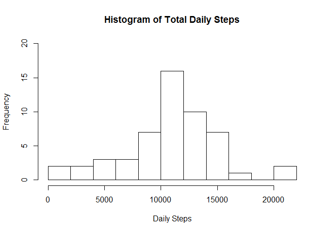
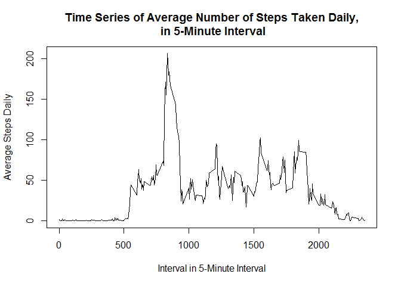
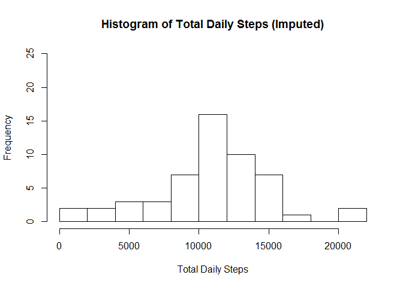
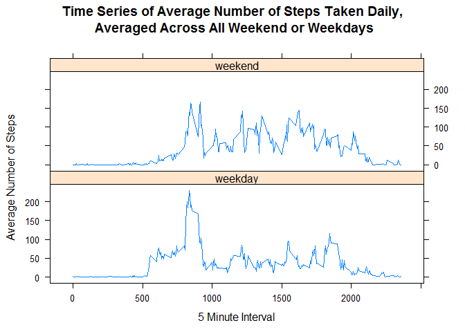

Reproducible Research - Peer Assessment 1
================

Loading and preprocessing the data
----------------------------------

The variables included in this dataset are:

-   steps: Number of steps taken in a 5-minute interval (missing values = NA)
-   date: The date when the measurement was taken in YYYY-MM-DD format
-   interval: Identifier for the 5-minute interval in which measurement was taken

``` r
library(dplyr)
library(lattice)
```

Load data from source file. The source file is assumed to be stored and read from a specified local folder.

``` r
act <- read.csv("activity.csv")
summary(act)
```

    ##      steps                date          interval     
    ##  Min.   :  0.00   2012-10-01:  288   Min.   :   0.0  
    ##  1st Qu.:  0.00   2012-10-02:  288   1st Qu.: 588.8  
    ##  Median :  0.00   2012-10-03:  288   Median :1177.5  
    ##  Mean   : 37.38   2012-10-04:  288   Mean   :1177.5  
    ##  3rd Qu.: 12.00   2012-10-05:  288   3rd Qu.:1766.2  
    ##  Max.   :806.00   2012-10-06:  288   Max.   :2355.0  
    ##  NA's   :2304     (Other)   :15840

``` r
act$date<- as.Date(act$date)
```

What is mean total number of steps taken per day?
-------------------------------------------------

Calculate the total number of steps taken per day.

``` r
SumSteps <- aggregate(steps~date, act, FUN = sum,na.rm=TRUE)
colnames (SumSteps) <- c("date", "steps")
head(SumSteps)
```

    ##         date steps
    ## 1 2012-10-02   126
    ## 2 2012-10-03 11352
    ## 3 2012-10-04 12116
    ## 4 2012-10-05 13294
    ## 5 2012-10-06 15420
    ## 6 2012-10-07 11015

Plot a histogram of SumSteps.

``` r
hist(x = SumSteps$steps,
     main = "Histogram of Total Daily Steps", 
     xlab = "Daily Steps", ylab = "Frequency",
     ylim = c(0,20),
     breaks= 12.5)
```



Calculate the mean and median of the total number of steps taken per day.

``` r
#mean
mean(SumSteps$steps) 
```

    ## [1] 10766.19

``` r
#median
median(SumSteps$steps) 
```

    ## [1] 10765

What is the average daily activity pattern?
-------------------------------------------

Calculate average steps per interval.

``` r
AvgSteps <- aggregate(steps~interval,act, FUN = mean ,na.rm=TRUE)
names(AvgSteps)[2] <- "mean_steps"
str(AvgSteps)
```

    ## 'data.frame':    288 obs. of  2 variables:
    ##  $ interval  : int  0 5 10 15 20 25 30 35 40 45 ...
    ##  $ mean_steps: num  1.717 0.3396 0.1321 0.1509 0.0755 ...

Plot a time series of AvgSteps.

``` r
plot(x = AvgSteps$interval,
     y = AvgSteps$mean_steps,
     type = "l",
     main = "Time Series of Average Number of Steps Taken Daily,\n in 5-Minute Interval",      xlab= "Interval in 5-Minute Interval", ylab ="Average Steps Daily"
     )
```



Report Interval with highest average.

``` r
#highest average for an interval
AvgSteps[which.max(AvgSteps$mean_steps),]
```

    ##     interval mean_steps
    ## 104      835   206.1698

Imputing missing values
-----------------------

Calculate the total number of missing values.

``` r
#sum of missing values
sum(is.na(act$steps))
```

    ## [1] 2304

Impute missing values with the respective mean values for each day.

``` r
#positions of missing values
full_act <- act
nas <- which(is.na(act$steps))
#mean for each interval
mean_interval <- tapply(full_act$steps, full_act$interval, mean, na.rm=TRUE, simplify=TRUE)
#NAs replaced by mean for each interval
full_act$steps[nas] <- mean_interval[as.character(full_act$interval[nas])]
head(full_act)
```

    ##       steps       date interval
    ## 1 1.7169811 2012-10-01        0
    ## 2 0.3396226 2012-10-01        5
    ## 3 0.1320755 2012-10-01       10
    ## 4 0.1509434 2012-10-01       15
    ## 5 0.0754717 2012-10-01       20
    ## 6 2.0943396 2012-10-01       25

Plot a histogram of total steps per day with the new imputed data set.

``` r
#sum of steps per day
SumAct <-aggregate(steps~date, act, FUN=sum)
names(SumAct)[2] <- "sum_steps"
str(SumAct)
```

    ## 'data.frame':    53 obs. of  2 variables:
    ##  $ date     : Date, format: "2012-10-02" "2012-10-03" ...
    ##  $ sum_steps: int  126 11352 12116 13294 15420 11015 12811 9900 10304 17382 ...

``` r
#sum of missing values
sum(is.na(SumAct$sum_steps))
```

    ## [1] 0

``` r
hist(SumAct$sum_steps,  
     main="Histogram of Total Daily Steps (Imputed)",
     xlab="Total Daily Steps",
     ylab="Frequency",
     ylim=c(0,25), breaks = 10)
```



Calculate the mean and median of the new imputed data set.

``` r
#mean
mean(SumAct$sum_steps)  
```

    ## [1] 10766.19

``` r
#median
median(SumAct$sum_steps) 
```

    ## [1] 10765

-   By imputing the missing data with the average number of steps in the same 5-min interval, both the mean and the median are equal to the same value: 10766.19. This is because the inserted average number brings the median closer to the mean.

-   Compared to the first part of the assignment, there is a slight change to the median (1 step difference).

Are there differences in activity patterns between weekdays and weekends?
-------------------------------------------------------------------------

Create a new factor variable with 2 levels; weekend and weekday.

``` r
full_act <- mutate(full_act, daytype = ifelse(weekdays(full_act$date) == "Saturday" | weekdays(full_act$date) == "Sunday", "weekend", "weekday"))
full_act$daytype <- as.factor(full_act$daytype)
str(full_act)
```

    ## 'data.frame':    17568 obs. of  4 variables:
    ##  $ steps   : num  1.717 0.3396 0.1321 0.1509 0.0755 ...
    ##  $ date    : Date, format: "2012-10-01" "2012-10-01" ...
    ##  $ interval: int  0 5 10 15 20 25 30 35 40 45 ...
    ##  $ daytype : Factor w/ 2 levels "weekday","weekend": 1 1 1 1 1 1 1 1 1 1 ...

Plot a panel plot of the 5 minute interval and the average number of steps taken, averaged across all weekday or weekend days.

``` r
NewAvg <- aggregate(full_act$steps,list(interval=full_act$interval,weekdays=full_act$daytype),mean)
names(NewAvg) <- c("interval", "daytype", "mean")

xyplot(mean ~ interval | daytype, NewAvg, 
       type="l", 
       layout=c(1,2),
       main="Time Series of Average Number of Steps Taken Daily,\n Averaged Across All Weekend or Weekdays",
       xlab="5 Minute Interval", 
       ylab="Average Number of Steps"
)
```


